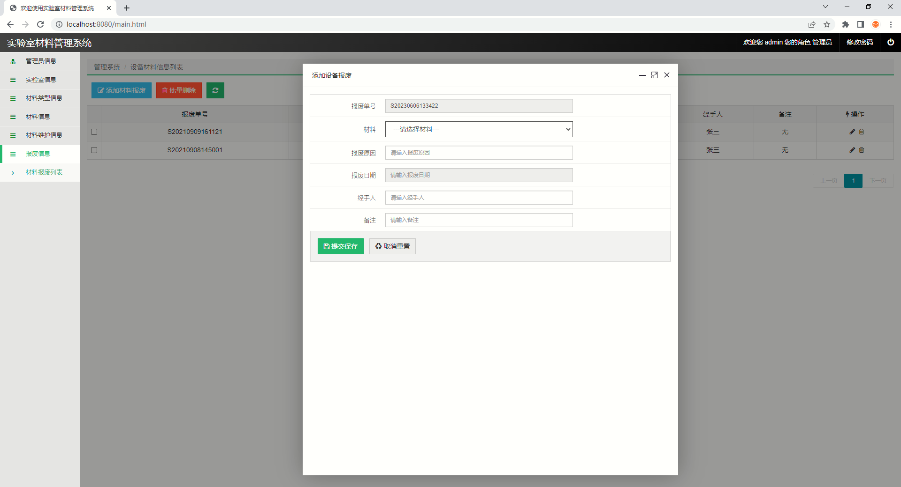

# 实验室材料管理系统

## 使用技术

### 后端：

Spring, SpringMVC, MyBatis

### 前端：

Vue, Html, Js

### 数据库：

 MySQL

### 系统展示

### 系统代码部分展示：

### 系统访问

访问地址：http://localhost:8080/equipment/
	用户名：admin			密码：admin

Contact: 需要请联系 vx: yhhchat  备注“git”
